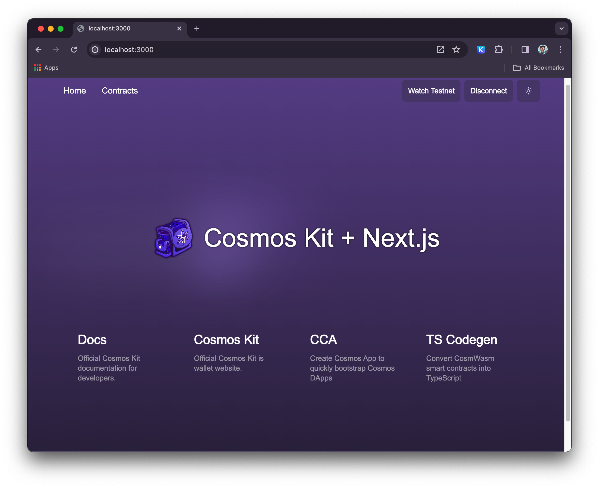
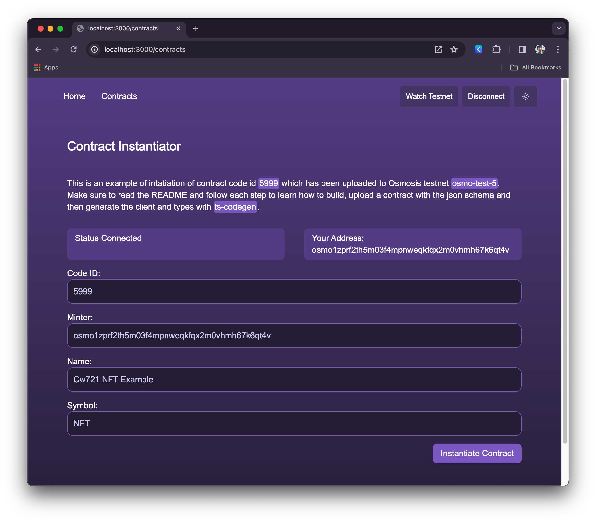

This is a [Next.js](https://nextjs.org/) project bootstrapped with [`create-next-app`](https://github.com/vercel/next.js/tree/canary/packages/create-next-app) and adapted to work with [Cosmos Kit] (https://cosmoskit.com/)

Live demo from latest build: https://cosmos-kit.vercel.app/



Contract instantiation example:


## This project was created with the following options:

```bash
npx create-next-app@latest
✔ What is your project named? … cosmos-kit-nextjs14
✔ Would you like to use TypeScript? … No / Yes
✔ Would you like to use ESLint? … No / Yes
✔ Would you like to use Tailwind CSS? … No / Yes
✔ Would you like to use `src/` directory? … No / Yes
✔ Would you like to use App Router? (recommended) … No / Yes
✔ Would you like to customize the default import alias (@/*)? … No / Yes
```

## 📚 Built With

This boilerplate was built using the following technologies:

- [Next.js](https://nextjs.org/): A React framework for production - it makes building static and dynamic React apps a breeze.
- [Cosmos-kit](https://cosmoskit.com/): An open-source wallet connector for the Cosmos ⚛️
applications.
- More examples and integrations coming soon!

## ✅ Enabled Features
- Cosmos-kit integration
  - Keplr Login
  - Leap Wallet Login
  - Web3auth Login (Login with Google Coming soon, WIP but you can enable it to play with it, it has a few open bugs still)
- React Toastify examples and integrated
- Example Contract: [CW-NFTS](https://github.com/CosmWasm/cw-nfts) 
  - Instantiation example
  - More interaction examples coming soon.
- TS-Codegen generation example

## Getting Started

First, run the development server:

```bash
npm run dev
# or
yarn dev
# or
pnpm dev
# or
bun dev
```

Open [http://localhost:3000](http://localhost:3000) with your browser to see the result.

You can start editing the page by modifying `app/page.tsx`. The page auto-updates as you edit the file.

This project uses [`next/font`](https://nextjs.org/docs/basic-features/font-optimization) to automatically optimize and load Inter, a custom Google Font.

## Example contract

We added a copy of cw-nfts contracts to the contracts directory which we are using to build a binary file, schema and typescript types. In this example we will use `contracts/cw-nfts/contracts/cw721-base` as an example.

## Install cargo make
```
cargo install cargo-make
```

### Build the Contracts

To compile the contracts to WebAssembly, run:

```sh
cd contracts/cw-nfts/
cargo make build
```
This command will generate the .wasm binaries for both contracts within the artifacts directory.

## Build optimized versions

```
docker run --rm -v "$(pwd)":/code \
  --mount type=volume,source="$(basename "$(pwd)")_cache",target=/target \
  --mount type=volume,source=registry_cache,target=/usr/local/cargo/registry \
  cosmwasm/optimizer:0.15.0
```

## Generate Javascript Schema

```
cargo make schema
```

## Upload binary to Celatone
Go to https://celatone.osmosis.zone/osmo-test-5/upload 
Upload the binary file from `contracts/cw-nfts/contracts/cw721-base/schema/cw721-base.json`

## Upload schema to Celatone
Once the binary is uploaded, you will need to upload the schema. The schema can be found in `contracts/cw-nfts/artifacts/schema.wasm.json`

## Code ID
The code id can be found in the on Celatone after uploading the binary file or by going to https://celatone.osmosis.zone/osmo-test-5/stored-codes. You might also use `5999` for testing purposes which was uploaded already.

The code ID is what can be used to instantiate the contract as seen on line 23 of app/contracts/page.tsx.


## Generating Typescript types
 In order to generate typescript types for the contracts, you will need to install `ts-codegen``. This can be done by running the following command:

### Install ts-codegen
 ```
 npm install -g ts-codegen
 ```

 ### Generate typescript types
 The following command will generate the typescript types for the contracts. The generated types will be placed in the `ts` directory.
 ```
 cd contracts/cw-nfts/contracts/cw721-base
 cosmwasm-ts-codegen generate \
          --plugin client \
          --schema ./schema \
          --out ../../../contract-client \
          --name cw721 \
          --no-bundle
```

This will generate a client which we will use with our application. They are stored in contract-client directory.


## Learn More about Cosmos Kit
To learn more about Next.js, take a look at the following resources: 

- https://cosmoskit.com/
- https://github.com/cosmology-tech/create-cosmos-app
- https://github.com/cosmology-tech/cosmos-kit
- https://github.com/cosmology-tech/cosmology
- https://github.com/CosmWasm/ts-codegen
- https://github.com/cosmology-tech/chain-registry


## Learn More about Next.js

To learn more about Next.js, take a look at the following resources:

- [Next.js Documentation](https://nextjs.org/docs) - learn about Next.js features and API.
- [Learn Next.js](https://nextjs.org/learn) - an interactive Next.js tutorial.

You can check out [the Next.js GitHub repository](https://github.com/vercel/next.js/) - your feedback and contributions are welcome!

## Deploy on Vercel

The easiest way to deploy your Next.js app is to use the [Vercel Platform](https://vercel.com/new?utm_medium=default-template&filter=next.js&utm_source=create-next-app&utm_campaign=create-next-app-readme) from the creators of Next.js.

Check out our [Next.js deployment documentation](https://nextjs.org/docs/deployment) for more details.

